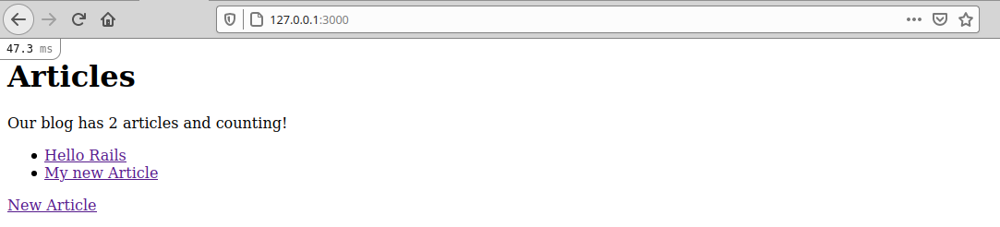

# A Very Simple Weblog

> This is our first app using Rails and it consists of a very simple Weblog according to [these tutorial instructions](https://guides.rubyonrails.org/getting_started.html) from [Rails Guides](https://guides.rubyonrails.org/index.html).

This project was built with the solo intent to get familiar with the process of creating a Rails app and how things generally look like.

## Built With

- Ruby 3.0.0
- Rails 6.1.3.2 (Ruby Gem)
- Sqlite 1.4.2 (Ruby Gem)

## Live Demo

No Live Demo has been provided for this Project. The deployment should be performed locally.

## Getting Started

To get a local copy up and running, please follow these steps:

### Prerequisites

For this project, the following environment should be previously installed on your machine:

- Ruby 3.0.0
- Rails 6.1.3.2
- Node 14.17.0
- Yarn 1.22.10

### Setup

- Go to your terminal bash and, on any directory of your preference, run `git clone git@github.com:enionsouza/blog_app.git`
- Next, run `cd blog_app` to go into the project root directory
- Run `bundle install` to install all Ruby Gems this project requires

### Install

- Run `rails db:migrate` to migrate the databases needed to run this project

### Usage

Whenever a password is requested, please remember to enter the following information:

- name: **dhh**
- password: **secret**

## Authors

👤 **Angela Natalia Cuahutle**

- GitHub: [@angelacuahutle](https://github.com/angelacuahutle/)
- Twitter: [@AngelaCunaDev](https://twitter.com/AngelaCunaDev)
- LinkedIn: [https://www.linkedin.com/in/angela-cuahutle-75228bab/](https://www.linkedin.com/in/angela-cuahutle-75228bab/)

👤 **Ênio Neves de Souza**

- GitHub: [@enionsouza](https://github.com/enionsouza)
- Twitter: [@enionsouza](https://twitter.com/enionsouza)
- LinkedIn: [https://www.linkedin.com/in/enio-neves-de-souza/](https://www.linkedin.com/in/enio-neves-de-souza/)

## 🤝 Contributing

Contributions, issues, and feature requests are welcome!

Feel free to check the [issues page](https://github.com/enionsouza/blog_app/issues).

## Show your support

Give a ⭐️ if you like this project!

## Acknowledgments

- [Microverse](https://www.microverse.org/)
- [The Odin Project](https://www.theodinproject.com/)
- [Rails Guides](https://guides.rubyonrails.org/index.html)

## 📝 License

This project is [MIT](./LICENSE) licensed.
